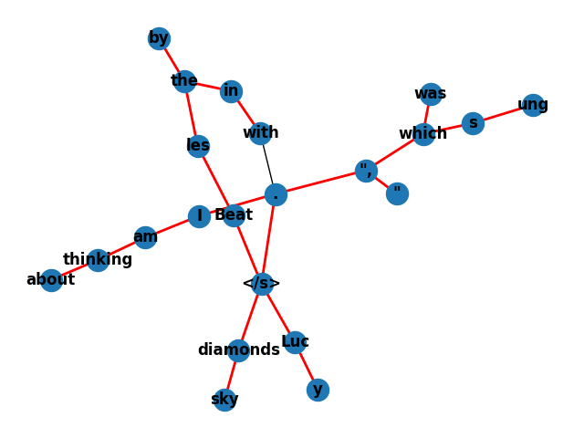

# Semantics-Probes
Semantics-Probes is a repo for probing into the semantic grouping/network of language understanding by leveraging the encoder hidden state space.

## A Minimum Spanning Tree
### from encoded token states of `'I am thinking about "Lucy in the sky with diamonds", which was sung by the Beatles.'`

